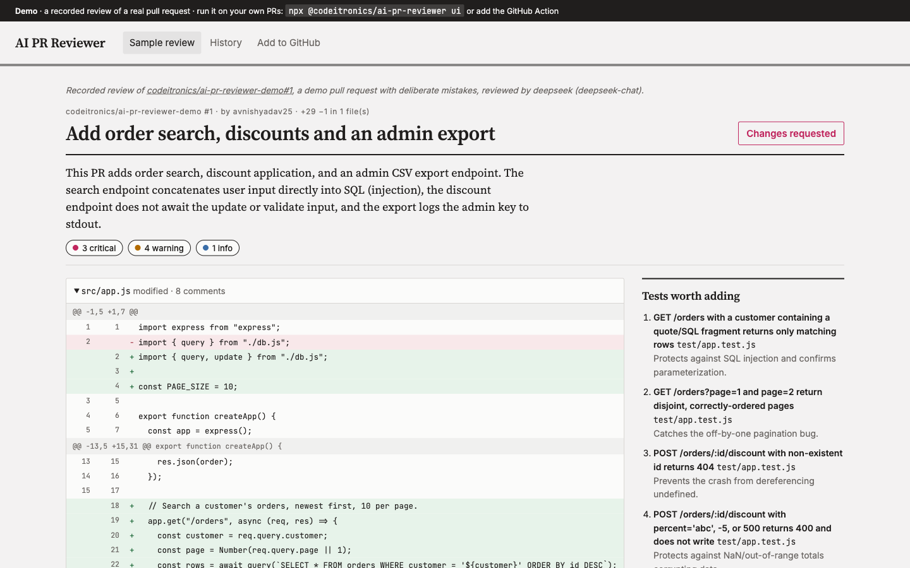
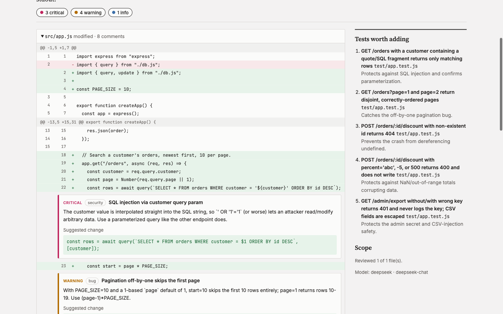
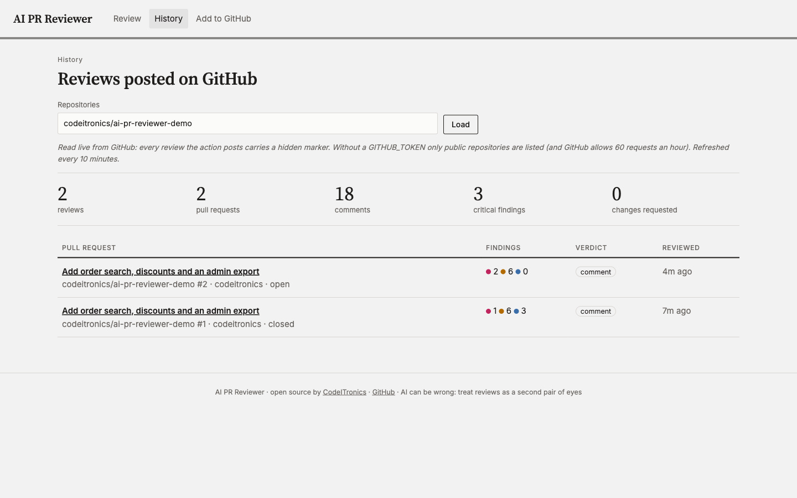

# AI PR Reviewer

AI code review on every pull request: comments on the exact changed lines, a short summary, and the tests worth adding. Works as a **GitHub Action**, a **CLI** and a **web UI**, with DeepSeek, Anthropic, OpenAI or Gemini.



**See it on a real pull request:** [codeitronics/ai-pr-reviewer-demo#2](https://github.com/codeitronics/ai-pr-reviewer-demo/pull/2) · **Try the web UI:** [demos.codeitronics.com/pr-review](https://demos.codeitronics.com/pr-review/)

On that demo PR (an orders API with five deliberate mistakes), the reviewer flagged all five on the right lines: an injectable SQL query, an off-by-one in pagination, a missing `await`, an unvalidated discount on a possibly missing order, and an API key written to the logs. It also raised three real issues we hadn't planted, and suggested five tests.

## Use it as a GitHub Action

1. Add your AI key as a repository secret, e.g. `DEEPSEEK_API_KEY` (**Settings → Secrets and variables → Actions**).
2. Add `.github/workflows/ai-review.yml`:

```yaml
name: AI review
on:
  pull_request:
    types: [opened, synchronize, reopened, ready_for_review]

permissions:
  contents: read
  pull-requests: write

jobs:
  review:
    runs-on: ubuntu-latest
    steps:
      - uses: codeitronics/ai-pr-reviewer@v1
        with:
          api_key: ${{ secrets.DEEPSEEK_API_KEY }}
          # provider: anthropic | openai | gemini   (default: deepseek)
          # request_changes_on: critical            (default: never)
```

Every new push to the PR gets a fresh review. Draft PRs are skipped until they're ready.

| Input | Default | What it does |
|---|---|---|
| `api_key` | (required) | Key for the AI provider |
| `provider` | `deepseek` | `deepseek`, `anthropic`, `openai` or `gemini` |
| `model` | provider default | `deepseek-chat`, `claude-sonnet-5-5`, `gpt-5-mini`, `gemini-2.5-flash` |
| `include_severity` | `info,warning,critical` | Which findings to post |
| `request_changes_on` | `never` | Submit as "changes requested" at or above this severity |
| `fail_on_critical` | `false` | Fail the workflow step on critical findings |
| `ignore` | none | Extra globs to skip (lockfiles, `dist/`, minified and snapshot files are skipped already) |
| `instructions_file` | `.github/ai-review.md` | Your team's review guidance, read from the PR's head commit |
| `max_diff_chars` | `60000` | Diff budget; files beyond it are listed as skipped |
| `max_comments` | `25` | Inline comment cap; the rest go into the summary |
| `skip_drafts` | `true` | Skip draft PRs |

Outputs: `comments`, `critical`, `verdict`, `review_url`.

### How it keeps comments on the right lines

GitHub rejects a whole review if a single comment points at a line outside the diff. So:

1. The model sees the diff with explicit new-file line numbers.
2. Every comment is checked against the lines GitHub will accept.
3. A comment that's slightly off moves to the nearest changed line, within three lines, and says so.
4. Anything still unplaceable goes into the summary.
5. If GitHub still refuses the inline comments (for example after a force-push), the findings are posted as a summary review instead of being lost.

## Use it from the terminal

```bash
export DEEPSEEK_API_KEY=...            # or ANTHROPIC_/OPENAI_/GEMINI_API_KEY
npx @codeitronics/ai-pr-reviewer review https://github.com/owner/repo/pull/123
npx @codeitronics/ai-pr-reviewer review owner/repo#123 --post        # post it (needs GITHUB_TOKEN)
git diff main... | npx @codeitronics/ai-pr-reviewer review -        # any diff, before you push
npx @codeitronics/ai-pr-reviewer review changes.patch --json
```

## Use the web UI

```bash
npx @codeitronics/ai-pr-reviewer ui    # http://127.0.0.1:4600
```

- **Review:** paste a PR link or a diff and see the comments inline, with severity filters and suggested fixes. With `GITHUB_TOKEN` set, you can review private repos and post the review.
- **History:** every review the action has posted on the repositories you choose, read back from GitHub (each review carries a hidden marker), with totals for findings and blocked PRs.

<table>
  <tr>
    <td></td>
    <td></td>
  </tr>
</table>

## What gets sent to the AI

Only the diff of the files being reviewed (and your `instructions_file`, if present). Lockfiles, build output, binaries and anything in `ignore` are skipped. The model's reply is validated before anything is posted.

AI review is a second pair of eyes, not a verdict: it can miss things and it can be wrong.

## Development

```bash
npm install
npm test           # diff parsing, line placement, formats, GitHub posting + fallback, action run, UI
npm run build      # dist/action.js (self-contained, committed for the Action) and dist/cli.js
npm run ui
```

## License

MIT. See [LICENSE](LICENSE).

---

Built by [CodeITronics](https://codeitronics.com). We build AI agents and developer tooling.
